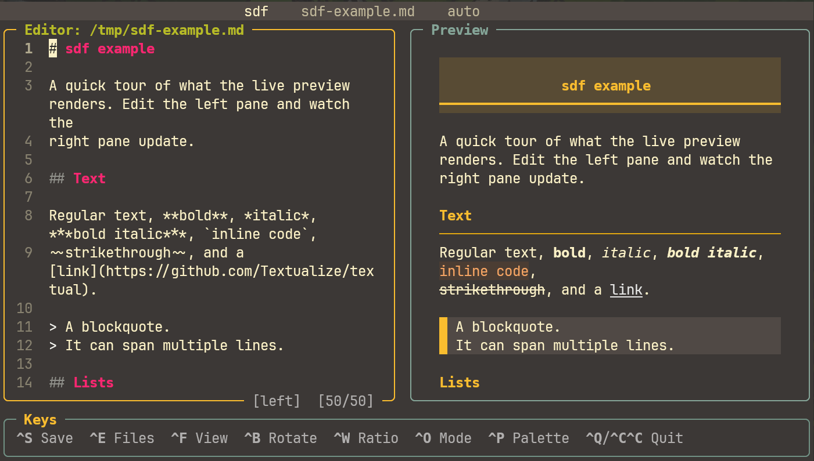

# SDF documentation

**SDF** (Simple Draft Frame) is a terminal markdown editor with a live, synced preview
that reloads when another process edits the open file.



## Contents

- [Keybindings](keybindings.md): every shortcut (global, browser, editor).
- [File browser](file-browser.md): navigation and file operations.
- [Preview & rendering](preview.md): per-file-type preview, markdown rendering,
  scroll sync, syntax highlighting.
- [Configuration & persistence](configuration.md): themes, transparency, conflict
  modes, the config file.

## Install

```bash
pipx install git+https://github.com/Helphyy/sdf.git
```

## Usage

```bash
sdf [file] [--example] [--version] [--conflict {auto,prompt}] [--theme NAME] [--transparent]
```

- `file`: markdown file to open (created on save if missing).
- `--example`: open the bundled example.
- `--version` / `-v`: print the version.
- `--conflict`: external-change behavior for this session (default: from config).
- `--theme`: Textual theme for this session (gruvbox, nord, dracula, ...).
- `--transparent`: transparent UI for this session.

## Conflict modes

When the file changes on disk while it is open:

- **auto** (default): if your buffer is clean, reload silently. If you have unsaved
  edits, a modal asks whether to reload the disk version or keep your buffer.
- **prompt**: a modal opens on every external change.

Toggle live with `Ctrl+O`. Detection uses an `(mtime_ns, size)` signature polled every
0.5 s, robust for local edits and agents writing the file.

## Stack

Python 3 + [Textual](https://github.com/Textualize/textual), tree-sitter language pack
for highlighting, and `pypdf` for PDF text. Only pip dependencies, no system binaries,
so it stays a clean `pipx install`.
